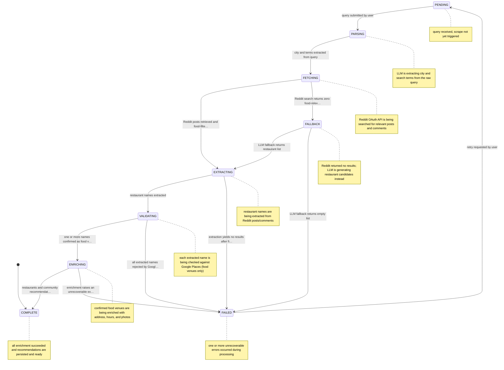

# Restaurant Recommendations

Accepts natural-language queries, searches real Reddit community discussions using the Reddit OAuth API, extracts restaurant names from posts and comments, validates each result against Google Places (food venues only), enriches with address/hours/photos, and returns ranked recommendations backed by community votes.

## Integrations

- **RedditAPI** — real community Reddit posts and comments about local restaurants
- **GooglePlacesAPI** — place details, hours, and photos for restaurants
- **OpenRouterAPI** — LLM-powered natural language query parsing (free-tier llama models)

## Business rules

- **Skip Enrichment When Place Data Already Exists** _(LOW)_ — Place details already fetched for this restaurant; skipping enrichment.
- **API Keys Required for Enrichment** _(HIGH)_ — Google Places API key must be configured; cannot enrich restaurant details.
- **Default City Fallback Required** _(LOW)_ — No city provided and DEFAULT_CITY environment variable is not set; cannot resolve location.
- **Google Places Must Confirm Food Venue** — Google Places returned a non-food venue for this name; skipping.

## Validation rules

- **Query Must Be Non-Empty** _(HIGH)_ — Query text and city are required to begin restaurant search.
- **Reddit Posts Must Be Present Before Extraction** _(MEDIUM)_ — Reddit post is missing required fields; cannot extract restaurants.
- **Extracted Restaurant Must Have a Name** _(MEDIUM)_ — Extracted restaurant must have a name and city to proceed with enrichment.

## Diagrams

### Request flow

How user input is interpreted, sent to RedditAPI, GooglePlacesAPI, OpenRouterAPI, and results are returned.

```mermaid
flowchart TD
    subgraph Sources["📥 Content Sources"]
        RedditAPI["RedditAPI
real community Reddit posts a…"]
        GooglePlacesAPI["GooglePlacesAPI
place details, hours, and pho…"]
        OpenRouterAPI["OpenRouterAPI
LLM-powered natural language …"]
    end
    Ingest[/"📄 Document
query received, scrape not ye…"/]
    subgraph Knowledge["🗂️ Structured Knowledge"]
        ParsedQuery (in-memory)[("Parsed Query (in-memory)")]
        RedditPost (in-memory)[("Reddit Post (in-memory)")]
        ExtractedRestaurant (in-memory)[("Extracted Restaurant (in-memory)")]
        PlaceDetails (in-memory)[("Place Details (in-memory)")]
        Restaurant[("Restaurant")]
        CommunityRecommendation[("Community Recommendation")]
        RestaurantVote[("Restaurant Vote")]
        Vote[("Vote")]
    end
    RedditAPI --> Ingest
    GooglePlacesAPI --> Ingest
    OpenRouterAPI --> Ingest
    Ingest --> ParsedQuery (in-memory)
    Ingest --> RedditPost (in-memory)
    Ingest --> ExtractedRestaurant (in-memory)
    Ingest --> PlaceDetails (in-memory)
    Ingest --> Restaurant
    Ingest --> CommunityRecommendation
    Ingest --> RestaurantVote
    Ingest --> Vote
    Ingest -. "analysis complete" .-> Done{{"✅ analysis stored"}}
```

### Parsed Query (in-memory) lifecycle

States a parsed query (in-memory) moves through from creation to completion.



## Data model

- **ParsedQuery (in-memory)** (terms, raw)
- **RedditPost (in-memory)** (id, title, selftext)
- **ExtractedRestaurant (in-memory)** (name, summary, source)
- **PlaceDetails (in-memory)** (name, service_options)
- **Restaurant** (id, name, city)
- **CommunityRecommendation** (id, restaurant_id, source)
- **RestaurantVote** (id, restaurant_id, fingerprint)
- **Vote** (id, recommendation_id, fingerprint)

## Lifecycle

- **PENDING** — query received, scrape not yet triggered
- **PARSING** — LLM is extracting city and search terms from the raw query
- **FETCHING** — Reddit OAuth API is being searched for relevant posts and comments
- **FALLBACK** — Reddit returned no results; LLM is generating restaurant candidates instead
- **EXTRACTING** — restaurant names are being extracted from Reddit posts/comments
- **VALIDATING** — each extracted name is being checked against Google Places (food venues only)
- **ENRICHING** — confirmed food venues are being enriched with address, hours, and photos
- **COMPLETE** — all enrichment succeeded and recommendations are persisted and ready
- **FAILED** — one or more unrecoverable errors occurred during processing

- PENDING → **PARSING**: query submitted by user _(guard: RULE_01)_
- PARSING → **FETCHING**: city and terms extracted from query _(guard: RULE_06)_
- FETCHING → **EXTRACTING**: Reddit posts retrieved and food-filtered successfully _(guard: RULE_02)_
- FETCHING → **FALLBACK**: Reddit search returns zero food-relevant posts
- FALLBACK → **EXTRACTING**: LLM fallback returns restaurant list
- FALLBACK → **FAILED**: LLM fallback returns empty list
- EXTRACTING → **VALIDATING**: restaurant names extracted _(guard: RULE_03)_
- EXTRACTING → **FAILED**: extraction yields no results after filtering
- VALIDATING → **ENRICHING**: one or more names confirmed as food venues by Google Places _(guard: RULE_07)_
- VALIDATING → **FAILED**: all extracted names rejected by Google Places type filter
- ENRICHING → **COMPLETE**: restaurants and community recommendations upserted to database
- ENRICHING → **FAILED**: enrichment raises an unrecoverable exception
- FAILED → **PENDING**: retry requested by user

## Actors

- **SystemPipeline** — writes: restaurants, community_recommendations
- **PublicAPI** — writes: restaurant_votes, votes

## Setup

Required environment variables:

- `GOOGLE_PLACES_API_KEY`
- `DEFAULT_CITY`
