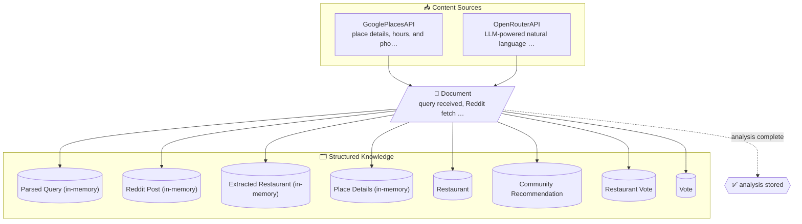
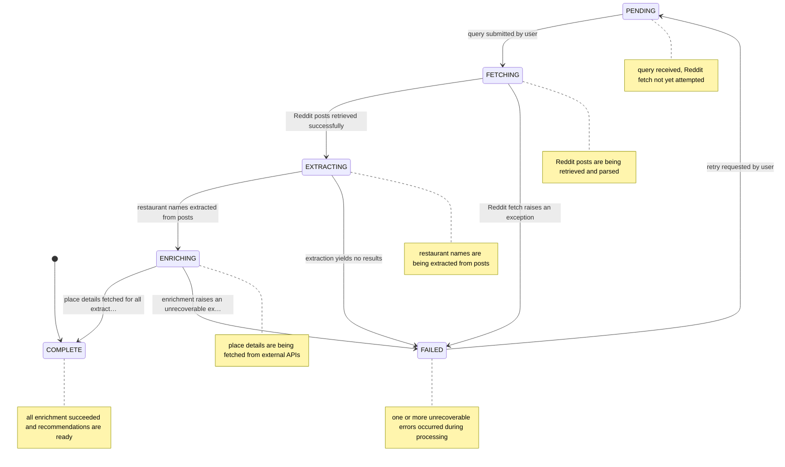

# Restaurant Recommendations

Accepts natural-language queries, fetches Reddit community discussions, extracts restaurant mentions, enriches them with place details from Google Places, and returns ranked recommendations.

## Integrations

- **GooglePlacesAPI** — place details, hours, and photos for restaurants
- **OpenRouterAPI** — LLM-powered natural language query parsing via Gemini Flash

## Business rules

- **Skip Enrichment When Place Data Already Exists** _(LOW)_ — Place details already fetched for this restaurant; skipping enrichment.
- **API Keys Required for Enrichment** _(HIGH)_ — Google Places API key must be configured; cannot enrich restaurant details.
- **Default City Fallback Required** _(LOW)_ — No city provided and DEFAULT_CITY environment variable is not set; cannot resolve location.

## Validation rules

- **Query Must Be Non-Empty** _(HIGH)_ — Query text and city are required to begin restaurant search.
- **Reddit Posts Must Be Present Before Extraction** _(MEDIUM)_ — Reddit post is missing required fields; cannot extract restaurants.
- **Extracted Restaurant Must Have a Name** _(MEDIUM)_ — Extracted restaurant must have a name and city to proceed with enrichment.

## Diagrams

### Request flow

How user input is interpreted, sent to GooglePlacesAPI, OpenRouterAPI, and results are returned.

### Parsed Query (in-memory) lifecycle

States a parsed query (in-memory) moves through from creation to completion.

## Data model

- **ParsedQuery (in-memory)** (terms, raw)
- **RedditPost (in-memory)** (id, title, selftext)
- **ExtractedRestaurant (in-memory)** (name, summary, source)
- **PlaceDetails (in-memory)** (name, service_options)
- **Restaurant** (id, name, city)
- **CommunityRecommendation** (id, restaurant_id, source)
- **RestaurantVote** (id, restaurant_id, fingerprint)
- **Vote** (id, recommendation_id, fingerprint)

## Lifecycle

- **PENDING** — query received, Reddit fetch not yet attempted
- **FETCHING** — Reddit posts are being retrieved and parsed
- **EXTRACTING** — restaurant names are being extracted from posts
- **ENRICHING** — place details are being fetched from external APIs
- **COMPLETE** — all enrichment succeeded and recommendations are ready
- **FAILED** — one or more unrecoverable errors occurred during processing

- PENDING → **FETCHING**: query submitted by user _(guard: RULE_01)_
- FETCHING → **EXTRACTING**: Reddit posts retrieved successfully _(guard: RULE_02)_
- FETCHING → **FAILED**: Reddit fetch raises an exception
- EXTRACTING → **ENRICHING**: restaurant names extracted from posts _(guard: RULE_03)_
- EXTRACTING → **FAILED**: extraction yields no results
- ENRICHING → **COMPLETE**: place details fetched for all extracted restaurants
- ENRICHING → **FAILED**: enrichment raises an unrecoverable exception
- FAILED → **PENDING**: retry requested by user

## Actors

- **SystemPipeline** — writes: restaurants, community_recommendations
- **PublicAPI** — writes: restaurant_votes, votes

## Setup

Required environment variables:

- `GOOGLE_PLACES_API_KEY`
- `DEFAULT_CITY`
